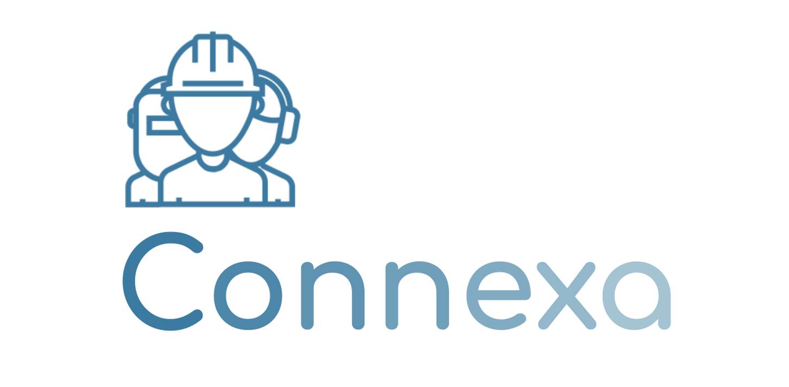

# Connexa

Connexa is a cutting-edge web application designed to simplify the process of finding reliable and skilled workers for various jobs. Whether you need an electrician to fix your wiring, a plumber to repair a leaky faucet, a woodcutter for your carpentry project, or a trustworthy driver for your transportation needs, Connexa is the go-to platform that connects you with qualified professionals in your area. Connexa is revolutionizing the way people connect with workers, making it easier than ever to find skilled professionals for various job requirements. Whether you're a homeowner, a business owner, or someone in need of specific services, Connexa is your go-to platform for finding trustworthy workers and creating successful partnerships. Experience the convenience and efficiency of Connexa today!

## `Features`

1. Comprehensive Worker Search: Connexa provides an extensive database of workers across multiple industries. Users can easily search for specific trades, such as electricians, plumbers, woodcutters, drivers, and many more. The intuitive search functionality allows you to refine your search based on location, availability, ratings, and other relevant criteria. With this platform, users can easily find and connect with skilled labourers from the comfort of their own homes, without having to search through listings or make multiple phone calls.
2. Detailed Worker Profiles: This information helps you make an informed decision when selecting the right worker for your job. Worker profiles also include ratings and reviews from previous clients, providing valuable insights into their performance and reliability.
3. Trust and Safety: Connexa prioritizes trust and safety by implementing a thorough verification process for workers. Background checks and verification of professional credentials are conducted to ensure the authenticity and reliability of workers on the platform. Additionally, Connexa employs a robust review system, encouraging transparency and accountability among both users and workers.
4. Access to a wider pool of skilled labourers: This platform can connect users with skilled labourers from a wider area, increasing the likelihood of finding a labourer that meets their specific needs.
5. Greater transparency: With platform, users can easily read reviews of skilled labourers from other users, helping them to make more informed decisions about who to hire.
6. More efficient communication: It can also allow users to communicate directly with skilled labourers, reducing the need for a middleman or lengthy email chains.
7. Improved Job Opportunities: Platforms may also help connect skilled labourers with new job opportunities, particularly if they are looking for freelance work or smaller gigs.
8. Quality Control: A platform can also help with quality control by allowing users to leave ratings on the services they receive, helping future clients make informed decisions.

## `Created Using`
> FrontEnd > ***HTML***, ***CSS***  
BackEnd > ***JavaScript***  
DataBase Used > ***FireBase***

### `You Can the Web-App Hosted in this link`
[Connexa](https://connexa-liard.vercel.app/)
